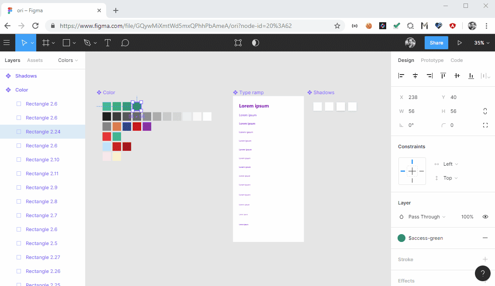

# Figma styles to SASS/LESS files
# THIS IS NO LONGET MAINTAINED AND MOVED HERE https://github.com/oriziv/figma-sass-less-plugin AS FIGMA PLUGIN
CAN BE FOUND [HERE](https://www.figma.com/community/plugin/742750636238601912/CSSGen) 

## Extract figma styles into scss/less files. 



### Prerequisites
You need to install [Node JS](https://nodejs.org/en/download/) if you dont have it already installed

### 1. Install NPM dependencies
```npm install```

### 2. Install gulp
```npm install -g gulp```
### 3. Get you figma personal access token
[Documentation on how to get tokens](https://www.figma.com/developers/docs#auth)

[How to create styles at figma file](https://www.youtube.com/watch?v=gtQ_A3imzsg)

[Learn More](https://www.youtube.com/channel/UCQsVmhSa4X-G3lHlUtejzLA)

### Run

```
gulp extract-figma-styles --token=<FIGMA_PERSONAL_ACCSESS_TOKEN> --fileId=<FIGMA_FILE_ID>
```
This will produce 3 files: colors.scss ,typo.scss and the json file figma output.
### More options

<details>
<summary>
--colorFormat
</summary>

`rgba/hex`

example: `--colorFormat=hex`
</details>

<details>
<summary>
--colorFilename
</summary>

name of the file contains the colors variables

default: `_colors`

example: `--colorFilename=my_colors`
</details>
<details>
<summary>
--typoFilename
</summary>

name of the file contains the texts styles mixins

default: `_typo`

example: `--typoFilename=typography`
</details>
<details>
<summary>
--output
</summary>

output fotmat `scss` or `less`

default: `scss`

example: `--output=less`
</details>
<details>
<summary>
--outputDir
</summary>

output location dir

default: `dist/`

example: `--outputDir=../build/`
</details>
